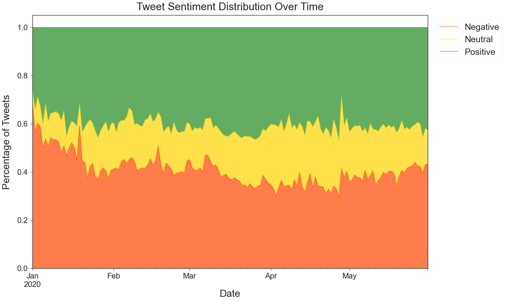
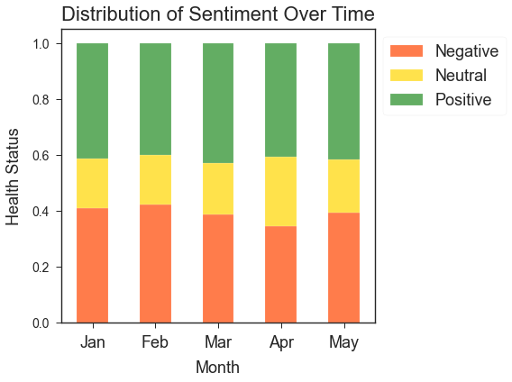
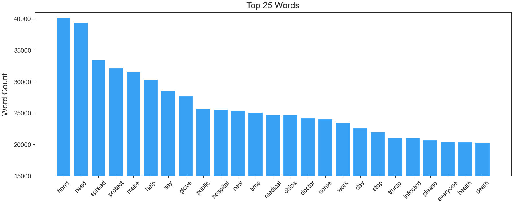
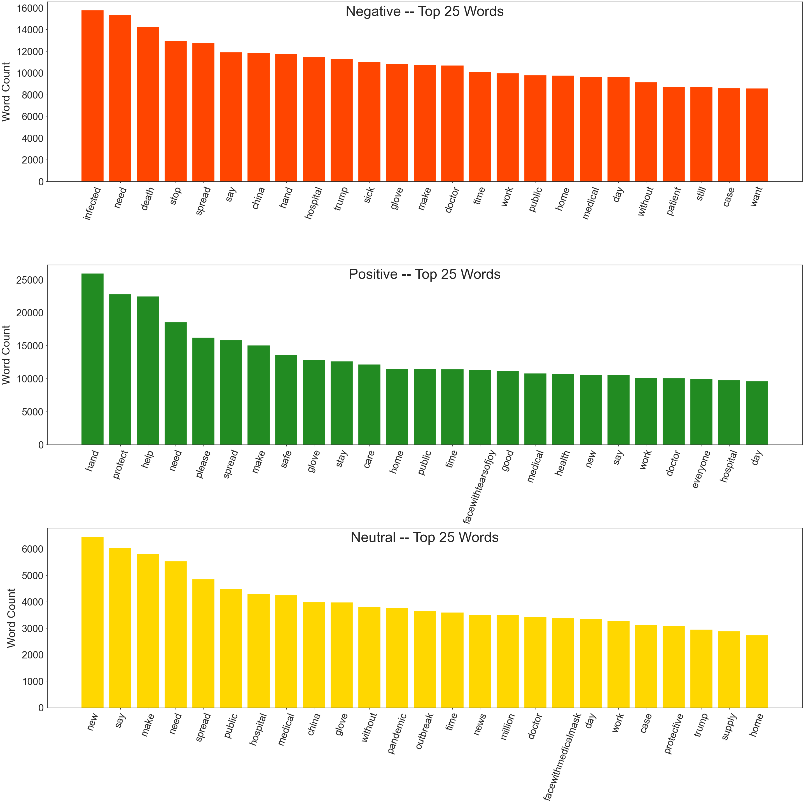
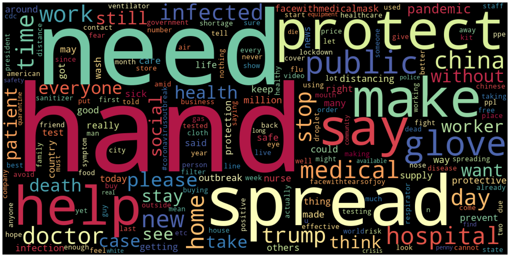
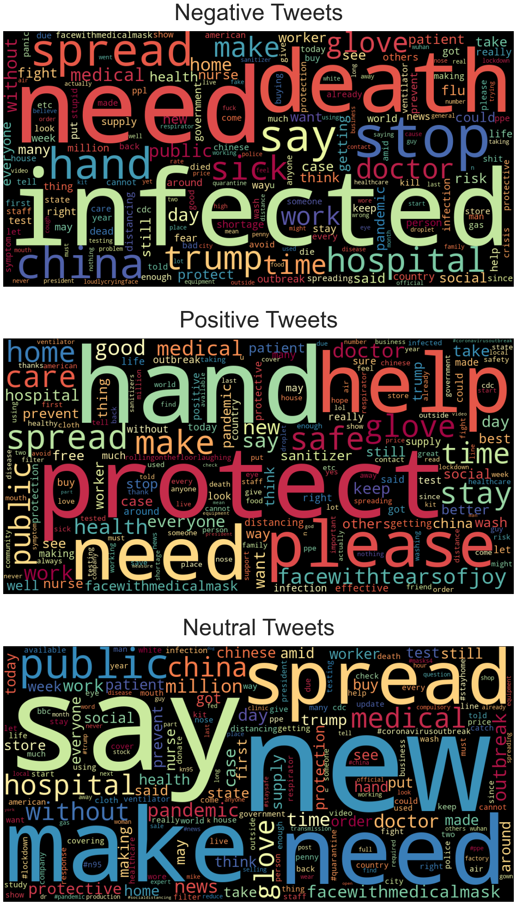
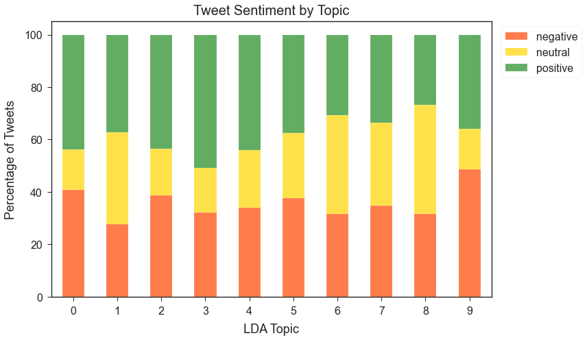
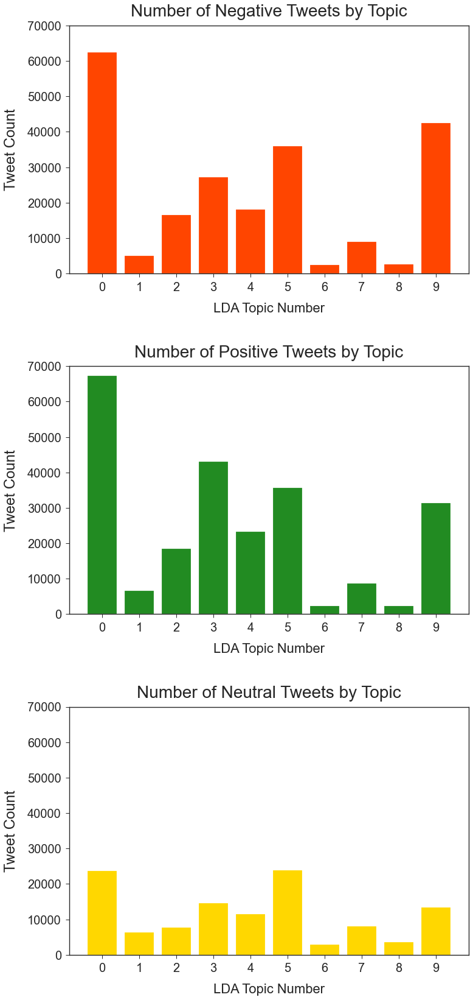

# #Masks Throughout COVID-19: A Twitter Sentiment Analysis

## Summary
After scraping Twitter with [twint](https://github.com/twintproject/twint), we use natural language processing (NLP) techniques to analyze the sentiment of tweets relating to masks and coronavirus and classify them as *negative*, *neutral*, or *positive*.

Through text processing, exploratory data analysis and feature engineering, we discover insights into how important words, topics, and subjectivity relate to sentiment.

We then create predictive models to provide further insight and confirm our findings during EDA.

## Objectives
1. Investigate how the sentiment of tweets change over time.
2. Explore data and find any meaningful differences in language between positive, negative, and neutral tweets. Addtionally, look at the role that Twitter stats (number of likes, replies, retweets) play in determining sentiment, if any. 
3. Engineer features by processing text and using LDA topic modeling to provide any insight toward tweet sentiment.
4. Build a classification model to discover which features play a strong role in the polarity of a tweet.
5. Calculate most frequent words and determine their relationship to tweet sentiment.

## Findings
- Tweets were generally more negative in January but relatively constant from February through May (there were also far fewer relevant tweets in January).

- After removing common English stopwords as well as topical stopwords like mask, and virus, the top ten most frequently occuring words were: hand, need, spread, protect, make, help, say, glove, public, and hospital.

- A 10-topic LDA model grouped words into the following topics with the following predominant sentiment:
    1. Protests, without masks            *split positive/negative*
    2. Mask advertisements                *split positive/negative/neutral*
    3. Biden, social distancing           *split positive/negative*
    4. Social distancing, protect others  *mostly positive*
    5. Fauci, regulations                 *mostly positive*
    6. Lockdown, testing                  *split positive/negative*
    7. News, statistics                   *mostly neutral*
    8. Trump, protests                    *split positive/negative/neutral*
    9. Protests, essential services       *mostly neutral*
    10. Social distancing, death, Trump   *mostly negative*

- Topic modeling provided some interesting insights but was not helpful in our best prediction models.

## Most prevalent features in the model (in order)
### 10 most common words (after removing stopwords):
    'hand'
    'need'
    'spread'
    'protect'
    'make'
    'help'
    'say'
    'glove'
    'public'
    'hospital'

### 10 best features (Decision Tree Classifier):
    'protect'   (0.0153)
    'infected'  (0.0141)
    'help'      (0.0138)
    'safe'      (0.0129)
    'hand'      (0.0110)
    'death'     (0.0096)
    'fight'     (0.0095)
    'sick'      (0.0094)
    'please'    (0.0092)
    'stop'      (0.0091)

# Final conclusion
The overall sentiment of tweets was fairly evenly divided between positive and negative throughout the five months. Our numerical data proved ineffective within our prediction models, so we ran models using only word vectors. Many of the words that were in the top 10 features make sense given the subject matter and do indeed relate directly to masks and the pandemic. Given more time we would try to get better accuracy via a deep learning model, most likely an LSTM model. Within that, and potentially within other models, we would like to try using pre-trained word vectors to see if that would provide us with better accuracy. Finally, we would like to further investigate sentiment toward the work mask (or masks) in particular as opposed to the overall sentiment of the tweet as a whole.

## List of files
- **.gitignore** - list of files and pathways to ignore
- **01_twitter_scraping_notebook.ipynb** - notebook detailing our scraping of tweets
- **02_data_cleaning_notebook.ipynb** - notebook of compiling our dataframes
- **03_nlp_features_eda_notebook.ipynb** - notebook with text processing, LDA topic modeling, subjectivity scoring, EDA, and visualizations
- **04_modeling_notebook.ipynb** - notebook with Naive Bayes and Decision Tree models
- **functions.py** - file with functions used in this project
- **presentation.pdf** - slides for our presentation of this project
- **README.md** - this very file!
- **archives** folder - old jupyter notebooks, mostly scrap
- **charts** folder - charts and visualizations created during the project
- **models** folder - tweet count vectors and a couple of lda topic models (note: unfortunately not the one in our presentation)

## Visualizations
- Sentiment Distribution Over Time:

- Sentiment Distribution by Month:

- Top 25 Words by Frequency (overall):

- Top 25 Words by Frequency (by sentiment):

- Word Cloud (overall):

- Word Cloud (by sentiment):

- Topic Distribution Over Time:

- Tweet Sentiment by LDA Topic:

- Topic Distribution by Sentiment:

<!-- - Decision Tree Confusion Matrix:
 -->

## Check out our [blog post](https://medium.com/@joshua.szymanowski/masks-throughout-covid-19-8e0af97ec33c)

