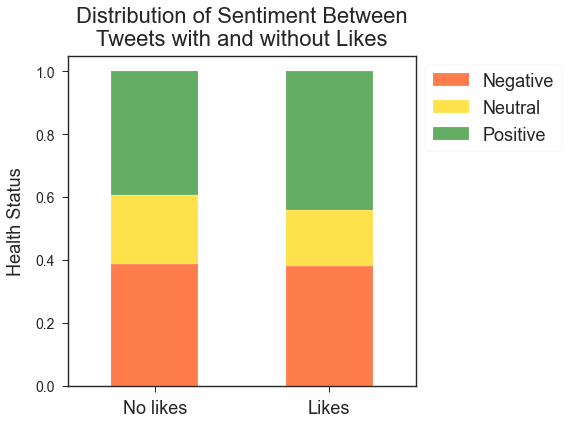
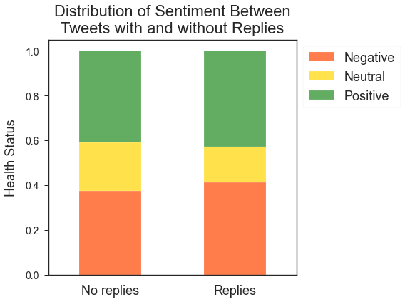
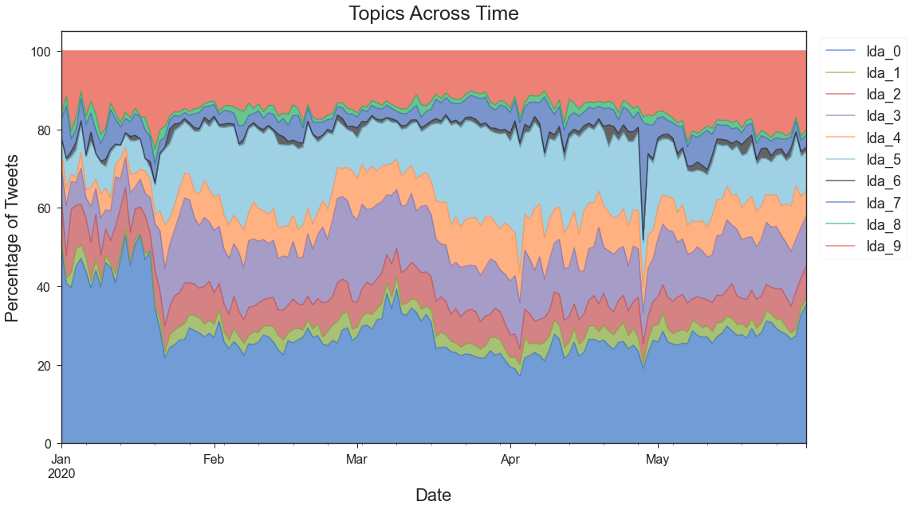
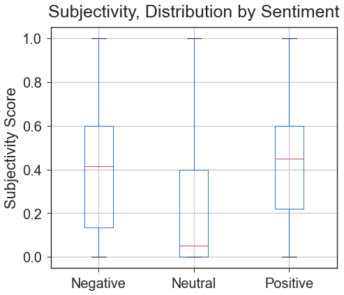
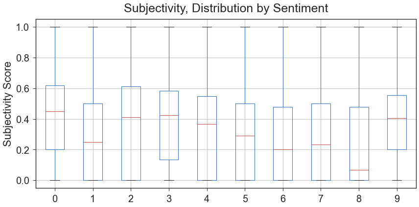
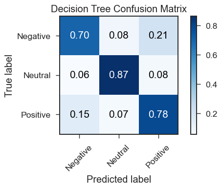
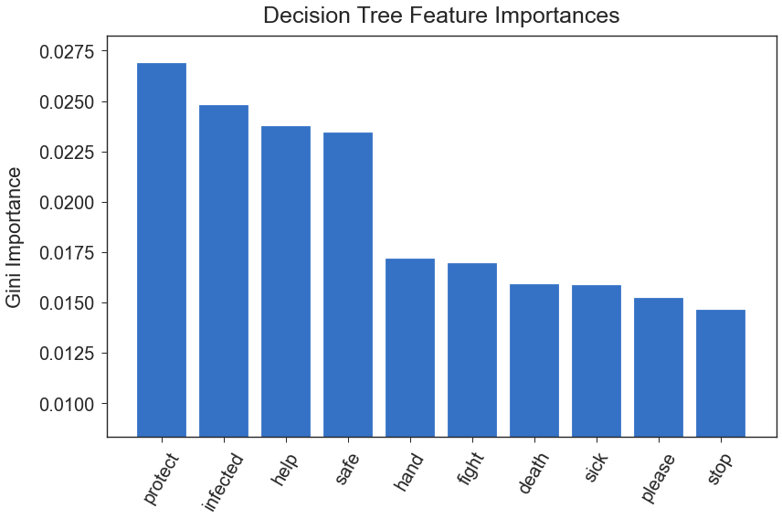

# #Masks Throughout COVID-19: A Twitter Sentiment Analysis

## Summary
After scraping Twitter with [Twint](https://github.com/twintproject/twint), we use natural language processing (NLP) techniques to analyze the sentiment of tweets relating to masks and coronavirus and classify them as *negative*, *neutral*, or *positive*.

Through text processing, exploratory data analysis and feature engineering, we discover insights into how important words, topics, and subjectivity relate to sentiment.

We then create predictive models to provide further insight and confirm our findings during EDA.

## Objectives
1. Investigate how the sentiment of tweets change over time.
2. Explore data and find any meaningful differences in language between positive, negative, and neutral tweets.
3. Look at the role that Twitter stats (number of likes, replies, retweets) play in determining sentiment, if any. 
4. Engineer features by processing text and using LDA topic modeling to provide any insight toward tweet sentiment.
5. Build a classification model to discover which features play a strong role in the polarity of a tweet.

## Findings

### 1. Sentiment over time
- Tweets were generally more negative in January but relatively constant from February through May. It is important to note that there were far fewer relevant tweets in January, since the pandemic was in its early days in this country.


<br/><br/>
- Mid-February is a point of interest, with a large spike in negative tweets, perhaps corresponding to the first rumblings of COVID in the US.

- Negativity appears to gradually decrease until the end of April, which corresponds with a spike in Topic 7 (Trump and the social distancing protests), and negativity increases until the end of May.

- Positivity has its strongest moments in mid- to late-March, but stays fairly constant throughout.
Overall, we don't see any overwhelming shift in sentiment, merely a fairly consistently polarized Twitterverse

- Looking at the sentiment distribution by month tells a similar story and further visualizes a downward trend in negative tweets through April. It is important to note though that positive tweets do remain relatively constant, with April showing instead an increase in the number of neutral tweets, which is most likely a result of wider news coverage.


<br/><br/>
### 2. Language use for each sentiment


- The results for frequently used words were not too suprising. After removing common English stopwords as well as topical stopwords like mask and virus, the top ten most frequently occuring words were: hand, need, spread, protect, make, help, say, glove, public, and hospital.

- Also in the top 25 were words like medical, doctor, Trump, and China.

- No hashtags or emojis made the top 25 overall.

- Looking at language by sentiment is a bit more interesting:


<br/><br/>
- Negative tweets
    - A surprising number of medical terms, but also things like death, Trump, and China.
- Positive tweets
    - Also a lot of medical terms, but alongside terms of safety and protection and public good.
- Neutral tweets
    - Medical terms are higher up the list here and there are a lot of more "newsy" and statistical terms like pandemic, outbreak, million, case, protective, and supply.

### 3. Twitter statistics (likes, replies, retweets) by sentiment

- Likes and retweets were highly (positively) correlated, so we looked at likes and replies only.

- We found no discernible relationship between sentiment and number of likes and replies. We did, however, discover a statistically significant relationship between whether or not a tweet received likes and replies and sentiment, as shown in the graphs below.




<br/><br/>
- Positive tweets tended to receive more likes, whereas negative tweets tended to receive more replies. Neutral tweets made up a lower proportion of tweets that received likes and replies.

### 4. Feature engineering

#### LDA topics
- We created an LDA model that weighted tweets into 10 topics. For a more complete look at the important words within each topic, view this [screenshot](charts/lda_topics.png) from the third notebook.
    - The table below shows a topic summary and predominant sentiment of each topic and can be used as a reference to graphs that follow.

|   | Topic summary                     | Predominant sentiment |
|---|-----------------------------------|-----------------------|
| 0 | Protests, without masks           | positive/negative     |
| 1 | Mask advertisements               | evenly divided        |
| 2 | Biden, social distancing          | positive/negative     |
| 3 | Social distancing, protect others | positive              |
| 4 | Fauci, regulations                | positive              |
| 5 | Lockdown, testing                 | positive/negative     |
| 6 | News, statistics                  | neutral               |
| 7 | Trump, protests                   | evenly divided        |
| 8 | Protests, essential services      | neutral               |
| 9 | Social distancing, death, Trump   | negative              |


- Looking at topics across time, there is an interesting spike in topic 7 toward the end of April. There is also a large share of topic 0 in the beginning of January, which in our opinion doesn't make much sense and points to some of the limitations of LDA topic modeling. There is a chance that it could be referring to the Hong Kong protests during that time, however.


<br/><br/>
- This next graph shows some definite relationships between topics and sentiment.


<br/><br/>
- Topic 1 (words like *design*, *#sale*, *shirt*), which seems to be about advertisements, along with the more news-like topic 6 (words like *news*, *study*, *claim*) and topic 8 (words like *data*, *nursing*), have a large proportion of *neutral* tweets.
    - Topic 8 does oddly contain *hoax* though this may be in relation to a news story reporting people's feelings toward COVID.
- Topic 9 has a lot of *negative* tweets, which seems to make sense, discussing things like trump, death, social distancing (viewed negatively by some).
- Topic 3 has the most *positive* tweets, which also seems to make sense, given words like *protect*, *help*, *others*, etc. It appears to be about the common good and using masks to help keep others safe.
- Topic 7 interestingly has about equal numbers for all sentiment categories, and it does indeed seem to be the most polarizing of topics.
- Topics 0 and 9 are relatively non-neutral.

#### Subjectivity
- We found that neutral tweets were, as expected, more objective (lower subjectivity scores), whereas positive and negative tweets were fairly equal in their subjectivity level.


<br/><br/>
- There was a range of different subjectivity level across topics, but it seemed to follow the trend of subjectivity by sentiment and the distribution of sentiment across topics.


<br/><br/>
### 5. Modeling

- While helpful during EDA, our engineered features, as well as the Twitter statistics, did not prove to be effective in predicting the sentiment of tweets.
    - Models using only the word vectors (created using a TD-IDF Vectorizer) were far more accurate than those using both the vectors and the numerical data.

- Our Bernoulli Naive Bayes was speedy (taking around 3 minutes to run) and achieved a 71.5% F1 score.

- Our best model was a Decision Tree with 'balanced' ```class_weight``` and a ```ccp_alpha``` of 0.00005; the latter parameter pruned our tree which helped the fitting tremendously and increased our F1 score to 76.7% (the F1 score for our training data was 77.1%). 
    - This model, however, took about an hour and ten minutes to run, so may not be ideal depending on the use case.
- See confusion matrix below.


<br/><br/>
- Again, word vectors were our most effective features, and these are the top ten features:


<br/><br/>
- The words were an interesting mix of words that were frequent in positive tweets (*protect*, *help*, *hand*, and *please* were in the top 5 most frequent words for this class) and negative tweets (*infected*, *death*, and *stop* were in the top 5 for this class).
*Fight* was not a very commonly used word and didn't appear in any top 25 list.

# Conclusions
Our main takeaway is that the Twitterverse (and perhaps the country) has been very polarized when it comes to discussing masks and COVID-19. Positive and negative tweets each made up around 40% of tweet sentiment during the observed period. While tweets did tend to be more negative in January, the sentiment quickly evened out in February and beyond.

Negativity hit a low point in March and April, but this was not accompanied by an opposite trend in positive tweets. Instead, the number of neutral tweets increased in this time. Unlike in the words of the Surgeon General, we did not observe any stark shifts in attitude in tweets about masks and coronavirus.

Finally, the power of words! Words themselves proved to be the most effective predictors of sentiment. While our other features were important during EDA, they did not prove to be effective in our models. In fact, they tended to lower the efficacy substantially.

## Next steps
In the future, since words were so important in our models, playing around with stop words and text processing could potentially yield even better results. Given the relative effectiveness and quickness of our Bernoulli Naive Bayes model, it may be worth taking all the tweets we scraped (rather than capping it at 5000 per day) and building a model around that.

We could also try to get better accuracy via a deep learning model, possibly LSTM, although the amount of time that model would take (not to mention all the tweaking) seems rather prohibitive. Using spaCy, Word2Vec, and/or Doc2Vec to build vectors may also prove to be more fruitful.

And finally, we would like to try to further investigate sentiment toward the word mask or masks itself, as opposed to the tweet as a whole.

## List of files
- **.gitignore** - list of files and pathways to ignore
- **01_twitter_scraping.ipynb** - notebook detailing our scraping of tweets
- **02_data_cleaning.ipynb** - notebook of compiling our dataframes
- **03_nlp_features_eda.ipynb** - notebook with text processing, LDA topic modeling, subjectivity scoring, EDA, and visualizations
- **04_modeling.ipynb** - notebook with Naive Bayes and Decision Tree models
- **functions.py** - file with functions used in this project
- **presentation.pdf** - slides for our presentation of this project
- **README.md** - this very file!
- **archives** folder - old jupyter notebooks, mostly scrap
- **charts** folder - charts and visualizations created during the project
- **models** folder - tweet count vectors and a couple of lda topic models (note: unfortunately not the one in our presentation)

## Check out my [blog post](https://medium.com/@joshua.szymanowski/masks-throughout-covid-19-8e0af97ec33c)