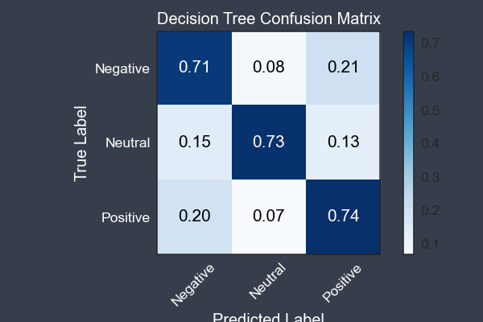
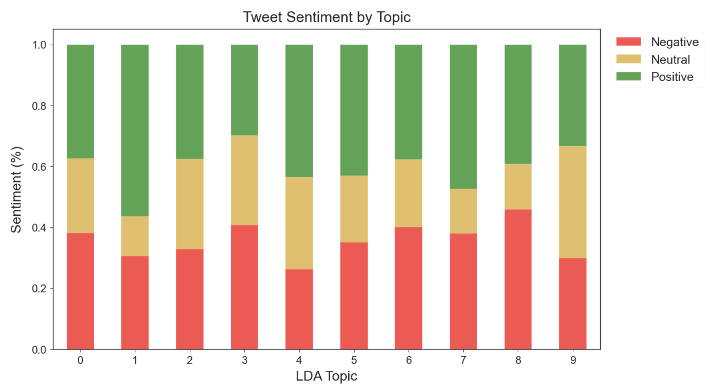
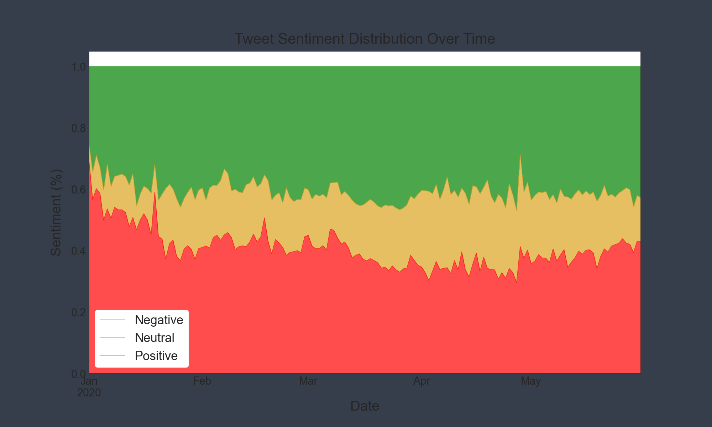
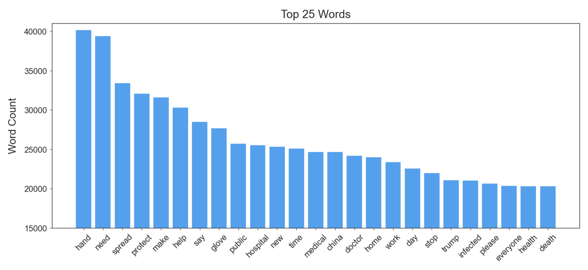
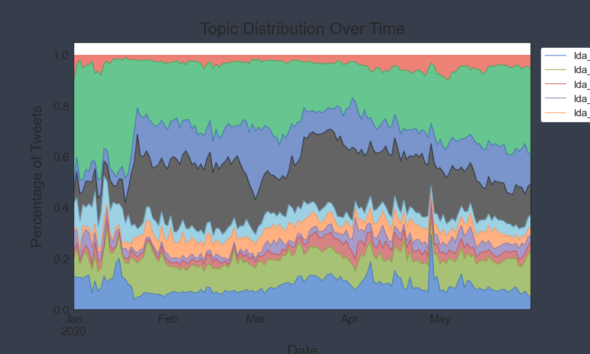
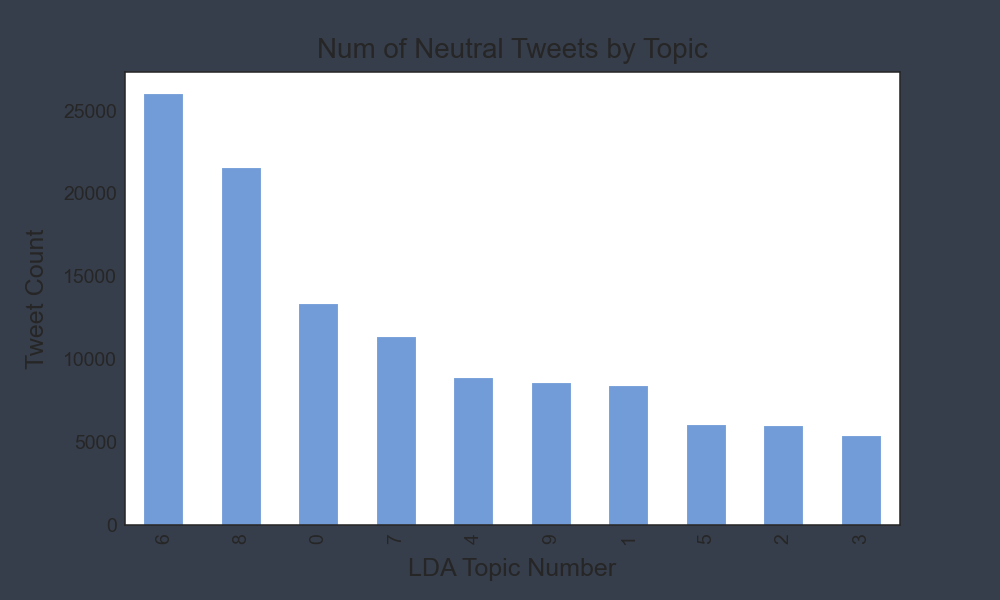

# #Masks Throughout COVID-19: A Twitter Sentiment Analysis

## Approach
Using [twint](https://github.com/twintproject/twint) to scrape Twitter, we perform natural language processing (NLP) techniques to analyze the sentiment of tweets relating to masks and coronavirus and classify them as Negative, Neutral or Positive. Through text processing, exploratory data analysis and feature engineering, we discover insights into how important words, topics, and subjectivity relate to sentiment. We then create predictive models to provide further insight and confirm our findings during EDA.

### Some questions:
* How does the sentiment of tweets change over time?
    * Hypothesis: Tweets will be more negative on average in January and get more positive on average as time goes on.
* Will Twitter stats (number of likes, replies, retweets) play a role in determining sentiment?
    * Hypothesis: The most important features will most likely be the words themselves.
* Does topic modeling provide any insight toward tweet sentiment or the COVID-19 crisis?
    * Hypothesis: Topic modeling should be a factor in determining sentiment and can give us insights into the pandemic.
* What insights can be provided by using machine learning?
    * Hypothesis: The lion's share of the insights will come during EDA.
* What are the most frequent words? And do they play a role in determining sentiment?

## Findings
- Tweets were generally more negative in January but relatively constant from February through May (there were also far fewer relevant tweets in January).

- After removing common English stopwords as well as topical stopwords like mask, and virus, the top ten most frequently occuring words were: hand, need, spread, protect, make, help, say, glove, public, and hospital.

- A 10-topic LDA model grouped words into the following topics with the following predominant sentiment:
  1. Healthcare workers, hospitals: split positive/negative
  2. Social distancing: positive
  3. Protesting, lockdowns: positive
  4. Government, health organizations: negative
  5. Spreading the virus: positive
  6. Emojis, swear words: positive
  7. COVID19 statistics: split positive/negative
  8. Preventing infection: positive
  9. General opinions: negative
  10. Riots, BLM: neutral

- Topic modeling provided some interesting insights but was not helpful in prediction modeling.

- Some of the features that prediction models weighed the heaviest were surprising:
	- Subjectivity Score
	- Number of likes
	- Number of retweets

## Most prevalent features in the model (in order)
### 10 most common words (after removing stopwords):
    'need'
    'spread'
    'protect'
    'make'
    'help'
    'say'
    'glove'
    'public'
    'hospital'
    'new'

### 10 best features (Decision Tree Classifier):
    Subjectivity score  (0.0611)
    Number of likes     (0.0139)
    'protect'           (0.0132)
    'help'              (0.0129)
    'infected'          (0.0115)
    'safe'              (0.0094)
    'please'            (0.0083)
    'death'             (0.0083)
    'hand'              (0.0076)
    Number of replies   (0.0072)

# Final conclusion
##### The overall sentiment of tweets was fairly evenly divided between positive and negative throughout the five months. There were some interesting results from our prediction models, namely that some continuous variables like subjectivity score, number of likes, and number of replies were some of the most important variables for predicting a tweet's sentiment. Other important features were words with high frequencies. Given more time we would try to get better accuracy via a deep learning model, including an LSTM model. And finally, we would like to further investigate sentiment toward the work mask (or masks) in particular as opposed to the overall sentiment of the tweet as a whole.

## List of files
- **Images** folder - charts and visualizations created during the project
- **.gitignore** - list of files and pathways to ignore
- **README.md** - this very file!
- **data_cleaning_notebook.ipynb** - notebook of compiling our dataframes
- **eda_visualizations_notebook.ipynb** - notebook with EDA and chart/visualization creations
- **functions.py** - file with functions used in this project
- **modeling_notebook.ipynb** - notebook with Naive Bayes and Decision Tree models
- **nlp_features_notebook.ipynb** - notebook with text processing, LDA topic modeling, and subjectivity scoring
- **twitter_scraping_notebook.ipynb** - notebook detailing our scraping of tweets

## Visualizations
- Decision Tree Confusion Matrix:

- Tweet Sentiment by LDA Topic:

- LDA Topics:

- Sentiment Distribution of Top 20 Tweets per Day:

- Sentiment Distribution Over Time:

- Top 25 Words by Frequency:

- Topic Distribution Over Time:

- Number of Negative Tweets by Topic:

- Number of Neutral Tweets by Topic:

- Number of Positive Tweets by Topic:

- Word Cloud of Top 100 Words:

- Word Cloud:

### BLOG POST FORTHCOMING

